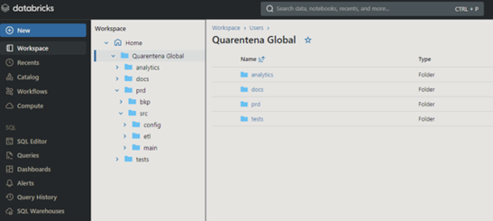
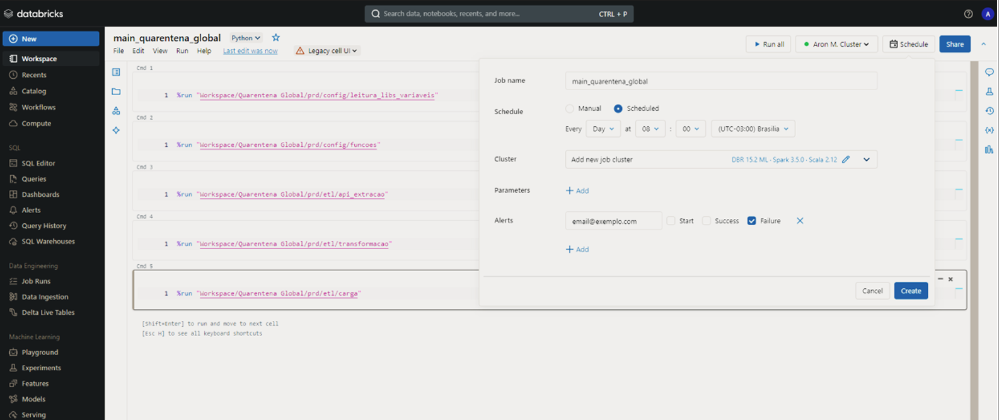
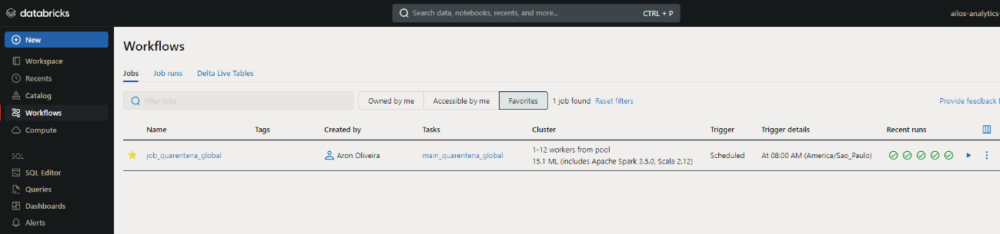

# Quarentena Inteligente e Cuidado com Clientes: Estratégias técnicas com PySpark

## Introdução

A centralização de dados e a gestão eficiente das comunicações com clientes representam desafios críticos em ambientes empresariais modernos. Com a expansão de múltiplos canais de comunicação, tais como CRM, Marketing digital e outras plataformas de engajamento, torna-se imperativo manter a consistência e relevância das interações com os clientes. A eficácia das estratégias de comunicação está diretamente ligada à capacidade de consolidar informações provenientes de diversas fontes e de garantir o cumprimento das regras de supressão de clientes, prevenindo contatos excessivos ou inadequados.


## Objetivo

O objetivo da Tabela de Quarentena de Clientes é criar uma solução centralizada que permita:
- Consolidar dados de diferentes canais de comunicação em uma única base de dados no Databricks.
- Monitorar e controlar a frequência de comunicações com cada cliente de acordo com regras de negócio definidas.
- Implementar um mecanismo de quarentena para evitar comunicações excessivas e desnecessárias com os clientes.


Embora exista um Data Lake centralizado, ele pode não contemplar todos os canais de comunicação em sua totalidade devido a constantes mudanças e expansões. Diante desse contexto, desenvolvemos a Tabela de Quarentena utilizando tecnologias de Big Data, como PySpark, e com a infraestrutura de processamento distribuído do Databricks, conseguimos manipular grandes volumes de dados de maneira eficiente, possibilitando a aplicação de regras complexas de negócio.


## Estrutura do Projeto

Para organizar o projeto de forma eficiente, utilizaremos uma estrutura de pastas dentro do Workspace Databricks, similar a desenvolvimento de software, separando o código-fonte das demais interfaces de configurações, apis, entre outros, permitindo uma melhor gestão e manutenção do código.
Definimos o nome da aplicação de 'Quarentena Global'.

```
|-- Quarentena Global
    |-- analytics
    |-- docs
    |-- tests
    |-- prd
        |-- src
            |-- config
            |-- etl
            |-- main
                |-- quarentena_global.ipynb
```




### Descrição das Pastas

- **analytics**: Contém consultas SQL utilizadas para análise de dados e geração de insights.
- **docs**: Documentação, guias técnicos e atualizações.
- **tests**: Scripts de validação e verificação da integridade dos dados.
- **prd**: Contém o código de produção organizado em subpastas:
  - **src**: Código-fonte da solução.
    - **config**: Arquivos de configuração e parâmetros (libs, functions, variáveis etc).
    - **etl**: Scripts de ETL responsáveis pela extração, transformação e carregamento dos dados.
    - **main**: Script principal responsável por orquestrar o processo de ETL.
   
   

### Origem dos dados
Para as campanhas de relacionamento com o cliente, são gravados dados de atuação em arquivos Excel (xlsx) no Sharepoint.<br>
Para as campanhas do Marketing, existe uma estrutura de pastas que podem ser acessadas via Protocolo de Transferência Seguro (SFTP) do Salesforce Marketing Cloud com arquivos csv.<br>
Também uma base de suspeitas de fraude que são registradas no Data Lake em um bucket S3 da AWS em parquet, além de um arquivo json com uma lista de restritos.
Por fim,  campanhas de recomendação de produtos e ofertas que já estão disponíveis no Delta Lake do Unity Catalog. 


As regras de negócio estabelecem períodos de quarentena específicos para cada canal:

- CRM = 30 dias
- Marketing = 7 dias
- Recomendação = 15 dias
- Restritos = 90 dias
- Ofertas = 5 dias
- Fraude = Até a exclusão do registros na base de origem


Trabalhamos com múltiplos formatos de arquivo: xlsx, csv, json, parquet e delta. Vamos então proceder com a implementação.

### Desenvolvimento
####  1. Leitura de Bibliotecas e Configuração

Para esta abordagem, utilizamos um notebook na pasta `config` para carregar as bibliotecas necessárias e configurar as variáveis de ambiente. A configuração do Spark permite criar uma sessão de Spark que será utilizada para processamento distribuído, nomeada 'QuarentenaGlobal'.


```python
# config/leitura_libs_variaveis.ipynb

import pandas as pd
import paramiko
from office365.sharepoint.client_context import ClientContext
from office365.runtime.auth.authentication_context import AuthenticationContext
from pyspark.sql import SparkSession
from pyspark.sql.functions import col, to_date, current_date, date_add, datediff

# Configuração do Spark
spark = SparkSession.builder.appName("QuarentenaGlobal").getOrCreate()

```


#### 2. Funções Utilizadas

Definimos funções específicas para conectar e extrair dados de diversas fontes, como SharePoint e SFTP. Essas funções são essenciais para a etapa de extração de dados e estão armazenadas no notebook na pasta `config`, juntamente com códigos de parâmetros, bibliotecas e variáveis.


```python
# config/funcoes.ipynb
	
# Conexão com SharePoint
def connect_to_sharepoint(site_url, username, password):
    ctx_auth = AuthenticationContext(site_url)
    ctx_auth.acquire_token_for_user(username, password)
    ctx = ClientContext(site_url, ctx_auth)
    return ctx

def download_file_from_sharepoint(ctx, file_url, local_path):
    file = ctx.web.get_file_by_server_relative_url(file_url).execute_query()
    with open(local_path, "wb") as local_file:
        file.download(local_file).execute_query()

# Conexão com SFTP
def connect_to_sftp(host, port, username, password):
    transport = paramiko.Transport((host, port))
    transport.connect(username=username, password=password)
    sftp = paramiko.SFTPClient.from_transport(transport)
    return sftp

def download_file_from_sftp(sftp, remote_path, local_path):
    sftp.get(remote_path, local_path)
    sftp.close()
    transport.close()
```


#### 3. Extração de Dados

Na pasta `etl`, utilizaremos as funções definidas para extrair dados dos diferentes sistemas de origem e gravamos nos diretórios do Volumes do Databricks. 
**Em conformidade com as melhores práticas de segurança da informação e LGPD, os dados sensíveis das credenciais das APIs são ocultadas como variáveis de ambiente utilizando [Databricks Secrets](https://docs.databricks.com/en/security/secrets/index.html) `dbutils.secrets`.**


```python
# etl/api_extracao.ipynb

# Configurações
site_url = "https://<tenant>.sharepoint.com/sites/<site>"
username = dbutils.secrets.get('scope-sharepoint', 'sp_username')
password = dbutils.secrets.get('scope-sharepoint', 'sp_password')
file_url = "/sites/<site>/Shared Documents/crm_data.xlsx"
local_path_crm = "/dbfs/team/Volumes/temp/crm_data.xlsx"

host = "<sftp_salesforce_marketingcloud_host>"
port = 22
username_sftp = dbutils.secrets.get('scope-marketing', 'sftp_username')
password_sftp = dbutils.secrets.get('scope-marketing', 'sftp_password')
remote_path   = "/path/to/marketing_data.csv"
local_path_marketing = "/dbfs/team/Volumes/temp/marketing_data.csv"

# Extração dos dados do CRM
ctx = connect_to_sharepoint(site_url, username, password)
download_file_from_sharepoint(ctx, file_url, local_path_crm)
crm_data = pd.read_excel(local_path_crm) #transforma em Pandas Dataframe
crm_spark_df = spark.createDataFrame(crm_data) #converte para Spark Dataframe

# Extração dos dados do Marketing Cloud
sftp = connect_to_sftp(host, port, username_sftp, password_sftp)
download_file_from_sftp(sftp, remote_path, local_path_marketing)
marketing_data_df  = spark.read.options(header=True, sep:';').csv(local_path_marketing)

# Extração dos dados dos demais canais

recomendacao_data = spark.read.parquet("s3://bucket/recomendacao_data")
restritos_data 	  = spark.read.json("s3://bucket/restritos_data")
ofertas_data 	  = spark.read.format("delta").table("catalog.database.ofertas_data") 
fraude_data 	  = spark.read.format("delta").table("catalog.database.fraude_data")
```


Após extração dos arquivos, fazemos a leitura de todos eles em seus diferentes formatos, transformando-os em Spark Dataframes para serem trabalhados a seguir. *Note que utilizamos uma função do Pandas para ler o arquivo excel antes de transforma-lo.*

#### 4. Transformação dos Dados

Realizamos a limpeza, padronização e enriquecimento dos dados extraídos para garantir a consistência e a qualidade dos mesmos. Implementamos as regras de quarentena específicas para cada fonte de dados. É importante que todos os Dataframes tenham as mesmas colunas com os mesmos tipos de dados para posteriormente ser feito a união destes com seus respectivos filtros de periodicidade da quarentena.

Todos as fontes tem a coluna id_cliente como chave primária, além de informações de email, telefone, assunto e data de envio. Será necessário adicionar colunas informando a diferença de dias entre a data do processamento e a data do envio assim como, inferir a data da saída prevista, baseado na regra de negócio. Para isso, utilizaremos as funções `datediff` e `date_add` da lib do pyspark já importadas no notebook de bibliotecas. Além de renomear algumas colunas que tem títulos diferentes em algumas bases.


```python
# etl/transformacao.ipynb

# Limpeza e padronização dos dados CRM
cleaned_crm_data 	  = crm_spark_df.dropDuplicates().filter(col('data_base') == current_date())
standardized_crm_data = (
	cleaned_crm_data.withColumn("qtd_dias", datediff(current_date(), col("data_envio")))
					.select("id_cliente", "email", "telefone", "assunto","data_envio", "qtd_dias")
					    )
					

# Limpeza e padronização dos dados de Marketing Cloud utilizando expressão SQL
cleaned_marketing_data 		= marketing_spark_df.dropDuplicates().filter(marketing_spark_df.email.isNotNull())
standardized_marketing_data = (
	cleaned_marketing_data.selectExpr(
		"id_cliente","email", "telefone", "subject as assunto",
		"data_envio", "date_diff(today(), data_envio) as qtd_dias")
			)


# Limpeza e padronização dos dados de suspeita de fraude
cleaned_fraude_data = fraude_data.filter(col('data_exclus').isNull())
standardized_fraude_data = (
	cleaned_fraude_data.withColumnRenamed("dt_inclus", "data_envio")
					   .withColumn("qtd_dias", datediff(current_date(), col("data_envio")))
					   .withColumn("assunto", lit('suspeita de fraude'))
					)


# Limpeza e padronização da lista de restritos
standardized_restritos_data = (
	restritos_data.select('id_cliente'
			,lit("Restritos").alias('canal')
			,col('contatos.email').alias('email')
			,col('contatos.numero_telefone').alias('telefone')
			,col('motivos.descricao').alias('assunto')
			,col('contatos.data_solicitacao').cast('date').alias('data_envio'))
		).distinct()
					

# Aplicação das regras de quarentena
quarentena_crm 		 	= standardized_crm_data.withColumn("saida_prevista", date_add(current_date(), 30))
quarentena_marketing 	= standardized_marketing_data.withColumn("saida_prevista", date_add(current_date(), 7))
quarentena_recomendacao = recomendacao_data.withColumn("saida_prevista", date_add(current_date(), 15))
quarentena_fraude 		= standardized_fraude_data.withColumn("saida_prevista", lit(None)).drop('data_exclus')
quarentena_restritos 	= standardized_restritos_data.withColumn("qtd_dias", datediff(current_date(), col("data_envio")))\
													 .withColumn("saida_prevista", lit(90))


# Unificação dos dados em uma única estrutura
consolidated_data = (
	quarentena_crm.where(col("qtd_dias") <= 30)
				  .union(quarentena_marketing.filter   ( col("qtd_dias") <= 7 ) )
				  .union(quarentena_recomendacao.filter( col("qtd_dias") <= 15) )
				  .union(quarentena_restritos.filter   ( col("qtd_dias") <= 90) )
				  .union(quarentena_ofertas.filter     ( col("qtd_dias") <= 5 ) )
				  .union(quarentena_fraude)
				  
		).withColumn("data_carga" lit(f'{current_date()}').cast('date'))

```


Note que, após a transformação dos dados, é possível unir todos os dataframes com dados distintos e filtrar a quantidade de dias de acordo a regra de negócio e acrescentar uma coluna referente a data da carga dos dados (aqui setado como '2024-05-28'). 
***Os clientes que ultrapassam a quantidade de dias estipulados, saem automaticamente da quarentena e ficam disponíveis para contato novamente, assim o histórico pode ser consultado através das datas de cargas passadas***.

#### 5. Carregamento dos Dados

Criaremos uma visão temporária associada ao dataframe `consolidated_data` utilizando a função `createOrReplaceTempView` *(esta será automaticamente removida quando a sessão Spark encerrar)*. 
Carregamos os dados da tempview na tabela 'quarentena_global' que será criada no Unity Catalog.
 
Com o Spark SQL, podemos executar um código DDL *(Data Definition Language)* para fazer a criação da tabela caso não exista no catálogo.  Em seguida, os dados consolidados da tempview são inseridos na tabela usando as cláusulas SQL `CREATE TABLE IF NOT EXIST` e `INSERT INTO`. A tabela será particionada por 'data_carga' e 'canal', com o 'id_cliente' e 'canal' como chaves primárias. 

Por fim, a base é armazenada no Delta Lake como tabela gerenciada *(Managed Table)* dentro de uma database que fica dentro de um catálogo, seguindo os [níveis hierárquicos dos objetos de dados do Unity Catalog](https://docs.databricks.com/pt/data-governance/unity-catalog/index.html): `catalog.database.quarentena_global`. 


```python
# etl/carga.ipynb

# Criação de view temporária
consolidated_data.createOrReplaceTempView('quarentena_global_tempview')


# Criação da tabela permanente no Unity Catalog
spark.sql("""
CREATE TABLE IF NOT EXIST catalog.database.quarentena_global (
    cpf STRING,
    canal STRING,
    email STRING,
    telefone STRING,
    assunto STRING,
    data_envio DATE,
    qtd_dias INT,
    saida_prevista DATE,
    data_carga DATE,
    PRIMARY KEY (cpf, canal)
)
PARTITIONED BY (data_carga, canal)
LOCATION '/user/hive/warehouse'
""")

# Inserção dos dados da view temporária na tabela permanente
spark.sql("""
INSERT INTO catalog.database.quarentena_global
SELECT * FROM quarentena_global_tempview
""")

# Mensagem de sucesso
print("Tabela quarentena_global criada com sucesso e dados inseridos.")

# Encerramento do spark
spark.stop()

```


#### 6. Execução e Agendamento

Por fim, temos o notebook principal na pasta `main` responsável por executar o pipeline e rodar todos os códigos dos notebooks anteriores na ordem já tratada até o momento. Utilizaremos o comando `%run` informando o caminho das pastas onde estão cada notebook em ordem de execução. Também é possível agendar a execução deste código principal na aba ‘Schedule’, com várias opções de data, horários, alertas e outras configurações adicionais, transformando essa execução em um job, podendo ser monitorado no Fluxo de trabalho ‘Workflows’ conforme ilustrado na imagem abaixo:







## Tabela Final - Integração com o Unity Catalog

No Unity Catalog, a tabela fica disponível para consultas, seja por meio do SQL Editor ou diretamente em um notebook, podendo salvar essas consultas na pasta `analytics` e utiliza-las em dashboards ou outras análises. Permite-se gerenciar, auditar e governar os dados em larga escala dentro do ambiente Databricks. Além de que é possível compartilhar e conectar esses dados com outros parceiros e serviços dentro do ecossistema Databricks, facilitando a colaboração e integração com diferentes áreas de negócios e parceiros externos.

Antes de realizar novas campanhas e ações de engajamento, é possível acessar facilmente a tabela para verificar os clientes que ainda estão em quarentena, garantindo que estes não sejam contatados prematuramente. Isso assegura o respeito às regras de quarentena e melhora a eficiência das campanhas ao evitar interações indesejadas com os clientes.


Visualização da tabela final:

```sql
select * from catalog.database.quarentena_global
```


| id_cliente | canal        | email                      | telefone   | assunto            | data_envio | qtd_dias | saida_prevista | data_carga |
|------------|--------------|--------------------------- |------------|------------------- |------------|--------- |----------------|------------|
| 1234567890 | CRM          | `cliente@exemplo.com`      | 999999999  | Campanha           | 2024-05-08 | 20       | 2024-06-07     | 2024-05-28 |
| 2345678901 | Marketing    | `marketing@exemplo.com`    | 988888888  | Email boas vindas  | 2024-05-24 | 4        | 2024-05-31     | 2024-05-28 |
| 3456789012 | Recomendacao | `recomendacao@exemplo.com` | 977777777  | Novo Produto       | 2024-05-18 | 10       | 2024-06-02     | 2024-05-28 |
| 1001001001 | Ofertas      | `ofertas@exemplo.com`      | 955555557  | Promoção           | 2024-05-26 | 2        | 2024-05-31     | 2024-05-28 |
| 4567890123 | Fraude       | `fraude@exemplo.com`       | 966666666  | Suspeita de fraude | 2024-04-01 | NULL     | NULL           | 2024-05-28 |
| 4888888800 | Restritos    | `restritos@exemplo.com`    | 944444443  | Reclamação         | 2024-03-01 | 88       | 2024-05-29     | 2024-05-28 |


## Conclusão

A implementação da Quarentena de Clientes utilizando os poderosos recursos de processamento distribuído e transformação de dados complexos do Spark no Databricks proporciona uma visão centralizada e consolidada das interações dos clientes através de múltiplos canais de comunicação. Este processo assegura a consistência das ações enviadas, respeitando a privacidade e preferências dos clientes, e evitando comunicações excessivas. Com o uso de tecnologias de Big Data, implementamos uma solução escalável e eficiente para a gestão das comunicações com clientes, atendendo as regras do negócio assim como às exigências de conformidade e segurança da informação.

A utilização de Delta Lake proporciona transações ACID *(Atomicidade, Consistência, Isolamento e Durabilidade)* e versionamento de dados, assegurando a integridade e consistência dos dados armazenados. O Unity Catalog facilita o gerenciamento, auditoria e governança dos dados em larga escala e permite que a tabela de quarentena seja compartilhada com outros parceiros da Databricks, facilitando a colaboração interdepartamental e com terceiros. Além disso, a tabela pode ser consultada antes de qualquer nova campanha ou ação, garantindo que os clientes em quarentena não sejam contatados, otimizando a eficácia das estratégias de comunicação e respeitando as políticas de quarentena estabelecidas.
